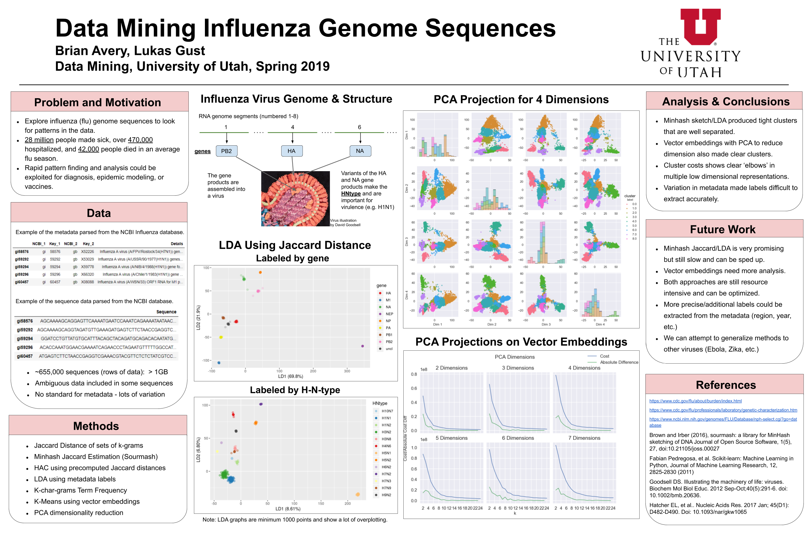

# data_mining_influenza

A project for CS 5140/6140 Data Mining at the University of Utah.

Here we derive methods to discover hidden structure in influenza protein and DNA sequences. All the data is found here: https://www.ncbi.nlm.nih.gov/genomes/FLU/Database/nph-select.cgi?go=database. We aim to use text analysis to discover relationships between influenza strands \<to what aim>. 

The influenza virus is a major public health issue. During the US annual flu seasons from 2010-2018 the CDC models estimate that over 28 million people are sickened, over 470,000 are hospitalized, and 42,000 people died on average per flu season (https://www.cdc.gov/flu/about/burden/index.html). Rapid DNA sequencing and characterization of influenza viruses is already used to track strains and to attempt to determine the origin of virus strains, particularly the most virulent ones (Garten et al. 2009). Rapid tracking and analysis facilitates the response to seasonal flu and potential flu epidemics. Computational analysis of genetic information is also being used to improve the yearly flu vaccine cocktail. 

## Project Structure

The majority of this project is based in *Jupyter Notebook*. That is where you will find all of the analysis that was done. There a couple supporting `.py` files that help speed up time consuming tasks and segregate large portions of utility code. 

Most of the images should be described inside of the notebooks where they are created.

-- Brian Avery & Lukas Gust

